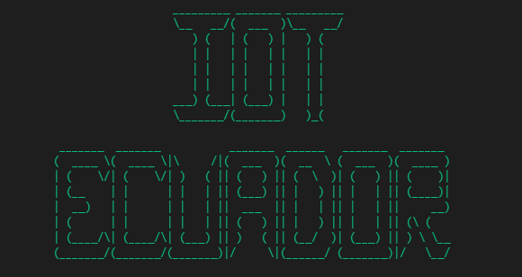
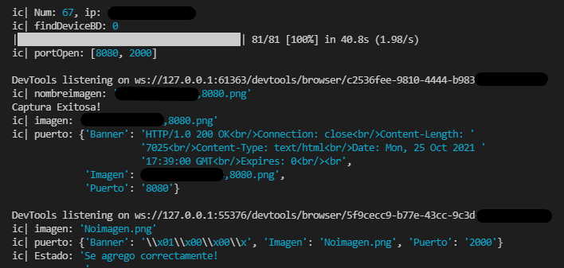
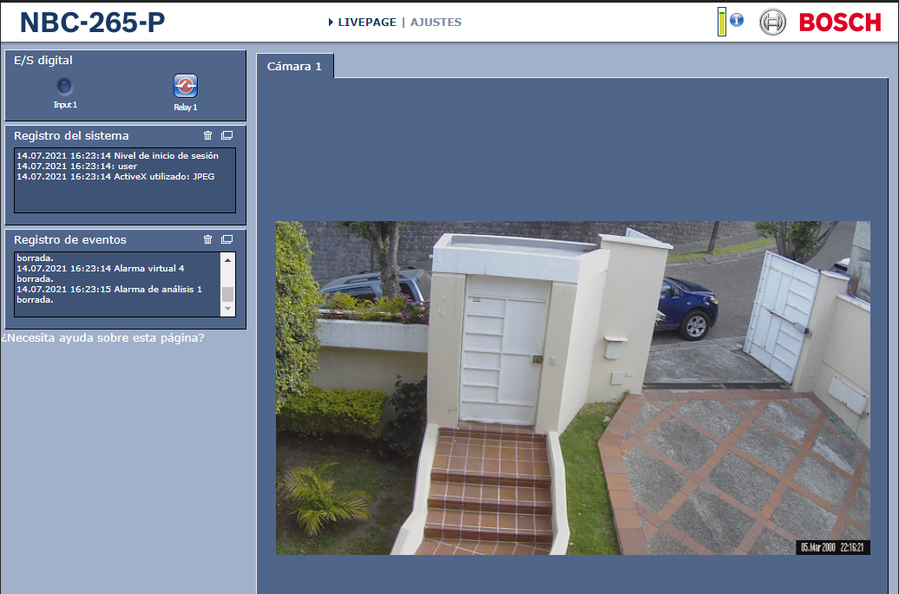

<h2 align="center">HERRAMIENTA DE ANÁLISIS DE VULNERABILIDADES EN DISPOSITIVOS IOT EN ECUADOR</h2>
 

La herramienta permite realizar un escaneo de puertos Iot ya establecidos por el desarrollador, dentro del rango de direcciones IPv4 asignadas al territorio de Ecuador. Además, cuenta con un sistema web para mostrar los resultados obetnidos de las direciones IPv4 analizadas. 

 
<h2 align="center">-- Herramientas de Desarrollo --</h2>

<h3>> Python </h3>

Lenguaje de programación que se destaca por trabajar en diversas plataformas y con grandes volúmenes de datos, ya que, al ser multiplataforma, favorece su extracción y procesamiento.

<h3>> Flask </h3>

Flask es un microframework escrito en Python mediante el cual se pueden crear Aplicaciones Web bajo el patrón MVC, Flask además cuenta con un gran conjunto de plugins que son fáciles de instalar y nos ayudan al desarrollo de una Aplicación Web.

<h3>> Mongo </h3>

Sistema de base de datos no relacional de código abierto, orientado a documentos por medio de una estructura BSON. Permite trabajar de manera distribuida utilizando el modelo de maestro esclavo.

<h2 align="center">Funcionalidades</h2>
 

Muestreo de direcciones IPV4 con puertos activos por provincia.

 

Captura de pantalla con su respectiva información

 

Visualizacion de resutltados en el sitio web (Camara web sin parametros de seguridad). 

<h2 align="center">Manual de Instalación</h2>
 

Debe tener las siguitenes herramientas installadas:
- [Git](https://git-scm.com/downloads) Descargar el proyecto.
- [Editor Código](https://git-scm.com/downloads) Visual Studio Code (Opcional).
- [Python](https://www.python.org/downloads/) Descargar el proyecto.
- [Navegador Chrome](https://www.googleadservices.com/pagead/aclk?sa=L&ai=DChcSEwiGz42B2ObzAhWFgoYKHbSlDlYYABAAGgJ2dQ&ohost=www.google.com&cid=CAESQOD293A8nzWdrEjnsfHi5n4ncA4pQVTh4Bsba4YEDLWa_SIyhKsdOudu82fmJtSQ4Lbg0pKttSSViqti32kXz28&sig=AOD64_3vO-gjcVe2MiygYxRXMcT4g1dhZA&q&adurl&ved=2ahUKEwiw1YWB2ObzAhUjtjEKHRzxBRQQ0Qx6BAgDEAE/) Realizar las capturas de pantalla.

1) Debe contar clonar el repositorio.
2) Abrir en proyecto dentro del Editor de Código.
3) Abrir la terminar dentro del archivo <b> Script </b> y ejecutar el siguite comando. **pip install -r requirements.txt** 
4) Abrir el terminal detro del directorio <b> ApiFlask </b> y ejecutar el siguite cpmando **pip install -r requirements.txt**
5) Ahora, ya esta todo listo!.

<b> Comando para correr el Script </b>| python test.py
 
<b>Comando para correr el Sistema Web </b>| flask run

Nota:
Debe cambiar la ruta del almancenamiento de capturas, debido que se la realizara de forma local.
 
En caso que las capturas salga un error, eso se debe a la version del navegador. ahora debe descargar la versión [Aquí](https://chromedriver.chromium.org/downloads)

librerias a tener en cuenta.

| Libreria | Package | Version |
| ------- | ------- | ------- |
| **PyMongo** | [`pymongo`](https://pypi.org/project/pymongo/) | 3.12.0 |
| **Sockets** | [`sockets`](https://pypi.org/project/sockets/) | 1.0.0 |
| **Selenium** | [`selenium`](https://pypi.org/project/selenium/) | 4.0.0 |
| **Pygeoip** | [`pygeoip`](https://pypi.org/project/pygeoip/) | 0.3.2 |
| **Ice-cream** | [`icecream`](https://pypi.org/project/icecream/) | 2.1.1 |
| **Logging** | [`logging`](https://pypi.org/project/logging/) | 0.4.96 |
| **ipWhois** | [`ipwhois`](https://pypi.org/project/ipwhois/) | 1.2.0 |

<h2 align="center">Equipo de Desarrollo</h2>
 
Edison Stalin Jumbo Jumbo.
 
Jefferson Ricardo Llumiquinga Llumiquinga.
<h2 align="center">Documentación</h2>

 Si, desea conocer más sobre el proyecto por favor ingrese: [Documentación](https://github.com/EdisonStalin/Flask_IotEcuador)

-------------------------------------

### _☣ Version_ V02.2021

-------------------------------------

<h2 align="center">DASHBOARD IOT ECUDOADOR</h2>

- [DASHBOARD](https://www.python.org/downloads/) Ingresa aquí.

### :warning: Advertencia!

***No somos responsables del mal uso del sistema***

Copyright (c) 2021-present, Edison Jumbo.
